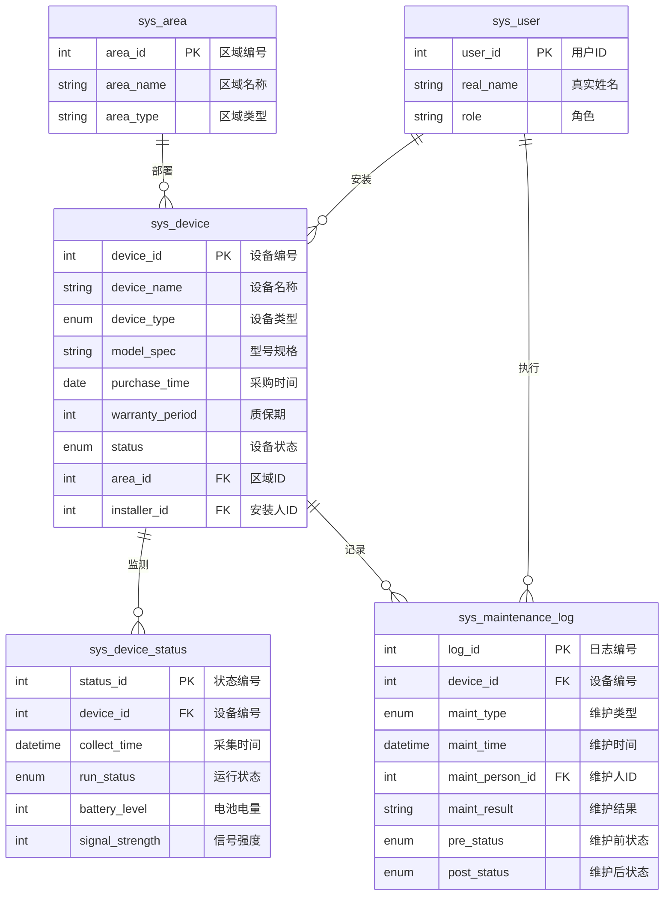

```mermaid
erDiagram
    %% 1. 外部依赖实体
    sys_area {
        int area_id PK "区域编号"
        string area_name "区域名称"
        string area_type "区域类型"
    }
    sys_user {
        int user_id PK "用户ID"
        string real_name "真实姓名"
        string role "角色"
    }

    %% 2. 设备管理核心实体
    sys_device {
        int device_id PK "设备编号"
        string device_name "设备名称"
        enum device_type "设备类型"
        string model_spec "型号规格"
        date purchase_time "采购时间"
        int warranty_period "质保期"
        enum status "设备状态"
        int area_id FK "区域ID"
        int installer_id FK "安装人ID"
    }

    sys_device_status {
        int status_id PK "状态编号"
        int device_id FK "设备编号"
        datetime collect_time "采集时间"
        enum run_status "运行状态"
        int battery_level "电池电量"
        int signal_strength "信号强度"
    }

    sys_maintenance_log {
        int log_id PK "日志编号"
        int device_id FK "设备编号"
        enum maint_type "维护类型"
        datetime maint_time "维护时间"
        int maint_person_id FK "维护人ID"
        string maint_result "维护结果"
        enum pre_status "维护前状态"
        enum post_status "维护后状态"
    }

    %% 3. 实体关系定义
    sys_area ||--o{ sys_device : "部署"
    sys_user ||--o{ sys_device : "安装"
    sys_device ||--o{ sys_device_status : "监测"
    sys_device ||--o{ sys_maintenance_log : "记录"
    sys_user ||--o{ sys_maintenance_log : "执行"
```
