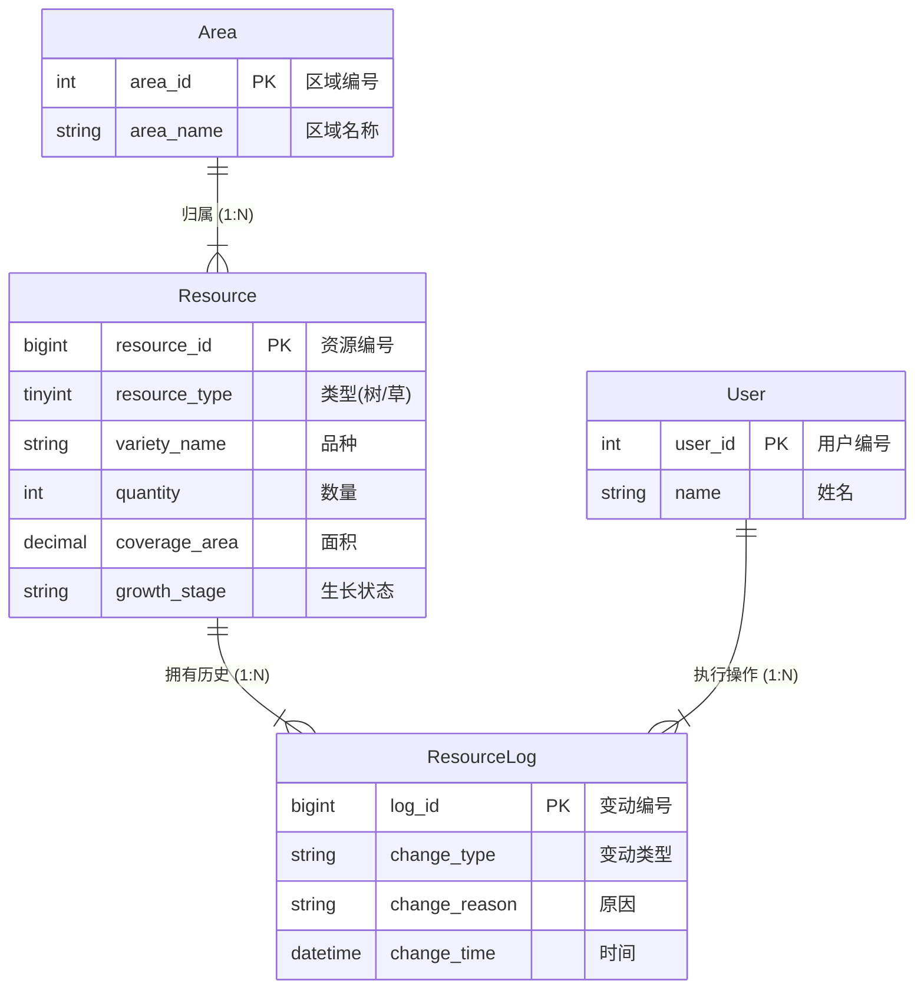

# 资源管理业务线 - 概念结构设计 (E-R图)

## 1. 局部 E-R 图预览
下图展示了林草资源、变动记录与外部实体（区域、用户）之间的关联关系。

## 2. 关系说明
1.  **归属关系**：一个区域 (Area) 可以包含多个资源 (Resource)，但一个资源只能属于一个区域。
2.  **历史关系**：一个资源 (Resource) 在生命周期中会产生多条变动记录 (ResourceLog)。
3.  **操作关系**：一个用户 (User) 可以执行多次操作，产生多条变动记录。
